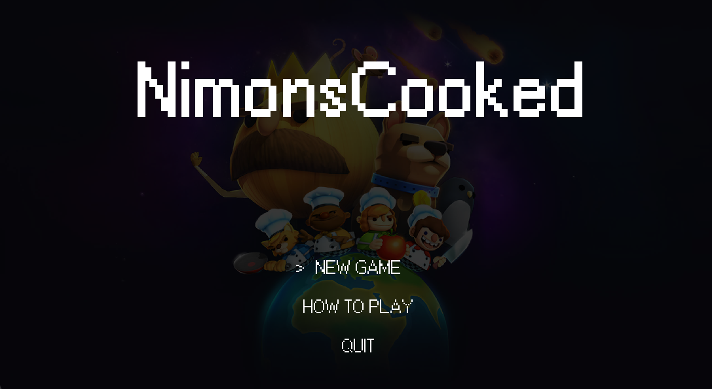

# NimonsCooked - Kitchen Cooking Simulator Game (Pizza Map)

**Tugas Besar Pemrograman Berorientasi Objek**  
Kelas K02 - Kelompok A  
Institut Teknologi Bandung

---



## Deskripsi Project

NimonsCooked adalah game simulasi dapur yang terinspirasi dari Overcooked. Pemain berperan sebagai koki yang harus mengelola berbagai stasiun dapur, memproses bahan makanan, memasak hidangan, dan melayani pesanan pelanggan dalam batas waktu tertentu.

Game ini dibangun menggunakan Java dengan menerapkan prinsip-prinsip Pemrograman Berorientasi Objek (OOP) secara menyeluruh, termasuk Design Patterns dan SOLID Principles.

---

## Fitur Utama

### Gameplay
- **Multiplayer Co-op**: Kontrol 2 koki secara bergantian (swap dengan tombol Space)
- **Stasiun Dapur**: 8 jenis stasiun (Cutting, Cooking, Assembly, Washing, dll)
- **Sistem Order**: Pesanan dinamis dengan timer dan scoring
- **Mekanik Kompleks**: Potong, masak, rakit, dan sajikan hidangan
- **Win/Lose Conditions**: Capai skor minimum atau gagal karena kesalahan beruntun

### Teknis
- **GUI dengan Java Swing**: Tampilan 2D dengan tile-based rendering
- **Real-time Processing**: Multi-threading untuk cutting, cooking, washing
- **State Management**: Ingredient state (RAW, CHOPPED, COOKED, BURNED)
- **Collision Detection**: Sistem collision untuk movement dan interaction
- **Map System**: Kustomisasi layout dapur via text file

---

## Struktur Project

```
src/main/java/
├── entity/          # Player entities (Chef)
├── ingredient/      # Food ingredients (Cheese, Chicken, Dough, dll)
├── inventory/       # Storage and containers (Plate, Storage<T>)
├── item/            # Game items (Dish, Oven)
├── station/         # Kitchen stations (Cutting, Cooking, Assembly, dll)
├── preparable/      # Interface untuk bahan yang bisa diproses
├── recipe/          # Recipe definitions
├── order/           # Order management system
├── object/          # Base game objects
├── tile/            # Map tile rendering
└── main/            # Main game loop dan UI

src/main/resources/
├── maps/            # Level layouts (text format)
├── objects/         # Sprite untuk ingredients
├── player/          # Sprite untuk characters
└── tiles/           # Sprite untuk stations dan floors
```

---

## Implementasi OOP

### 1. Inheritance (Pewarisan)
- Hierarki `SuperObject` > `Item` > `Ingredient`, `KitchenUtensils`
- Hierarki `SuperObject` > `Station` > berbagai concrete stations
- Hierarki `Entity` > `Chef`

### 2. Abstract Class & Interface
- **Abstract Classes**: `Station`, `Item`
- **Interfaces**: `Preparable`, `CookingDevice`, `Runnable`, `Cloneable`

### 3. Polymorphism
- Method overriding di semua station subclasses
- Method overloading (`interact(Entity)` vs `interact(Chef)`)
- Polymorphic collections (`SuperObject[]` menampung berbagai types)

### 4. Generics
- `Storage<T>` - Generic storage container dengan type safety
- Collections: `Set<Preparable>`, `List<Order>`, `Map<Ingredient, State>`

### 5. Exception Handling
- `IOException` untuk resource loading
- `InterruptedException` untuk thread operations
- `CloneNotSupportedException` untuk object cloning
- Try-catch-finally blocks untuk cleanup

### 6. Collections Framework
- **Set & HashSet**: Ingredients (mencegah duplikasi)
- **List & ArrayList**: Orders, recipes
- **Stack**: Plate management
- **Map & HashMap**: Recipe requirements
- **Arrays**: Game objects, tile grid

### 7. Concurrency (Multi-threading)
- Main game loop thread (60 FPS)
- Background threads untuk:
  - Cutting process (3 detik)
  - Washing process (3 detik)
  - Cooking/baking (12 detik + burning)
  - Plate cleanup (5 detik delay)
- Thread safety dengan `volatile` keywords

---

## Design Patterns

### 1. Singleton Pattern
- `TrashStation.getInstance()`
- `PlateStorage.getInstance()`
- Memastikan hanya ada 1 instance global

### 2. Strategy Pattern
- Interface `CookingDevice` dengan implementasi `Oven`
- `CookingStation` menggunakan strategy pattern untuk cooking devices
- Mudah extend dengan devices baru (Microwave, Stove, dll)

### 3. Template Method Pattern
- Abstract class `Station` dengan template methods
- Subclasses override hook methods (`interact()`, `placeItem()`)
- Common logic di parent class

### 4. Prototype Pattern
- `Ingredient.clone()` untuk membuat copy
- `IngredientStorage` menggunakan prototype untuk spawn ingredients

---

## SOLID Principles

### Single Responsibility Principle (SRP)
- Setiap class punya 1 tanggung jawab:
  - `CuttingStation` - hanya cutting logic
  - `OrderList` - hanya order management
  - `Recipe` - hanya recipe definition

### Open/Closed Principle (OCP)
- Open for extension: Bisa tambah station/ingredient baru
- Closed for modification: Tidak perlu ubah existing code

### Liskov Substitution Principle (LSP)
- Semua `Station` subclasses bisa substitute parent class
- `SuperObject[]` array works dengan semua subtypes

### Interface Segregation Principle (ISP)
- Small, focused interfaces:
  - `Preparable` (5 methods untuk food processing)
  - `CookingDevice` (7 methods untuk cooking)
- Tidak ada fat interfaces

### Dependency Inversion Principle (DIP)
- `CookingStation` depends on `CookingDevice` interface, bukan `Oven` concrete
- `Station` depends on `Item` abstract, bukan concrete types
- Dependency injection via constructors

---

## Cara Menjalankan

### Prerequisites
- Java Development Kit (JDK) 17 atau lebih tinggi
- Gradle 9.2.0+ (opsional, sudah include gradle wrapper)

### Build & Run

**Menggunakan Gradle Wrapper (Recommended):**

Windows:
```bash
# Build project
.\gradlew clean build

# Run dengan JAR file
java -jar build/libs/NimonsCook-1.0.0.jar

# Atau run langsung dengan Gradle
.\gradlew run
```

Linux/Mac:
```bash
# Build project
./gradlew clean build

# Run dengan JAR file
java -jar build/libs/NimonsCook-1.0.0.jar

# Atau run langsung dengan Gradle
./gradlew run
```

**Atau langsung dari IDE:**
1. Buka project di IntelliJ IDEA
2. Run `main/Main.java`

---

## Kontrol Game

### Keyboard Controls
- **Arrow Keys / WASD**: Gerakkan chef
- **C**: Interaksi dengan station/item
- **E**: Pick up / Drop item
- **Space**: Swap antara Chef 1 dan Chef 2
- **Shift**: Dash (cooldown 20 frames)

### Game States
- **Title Screen**: Menu awal
- **Tutorial**: Penjelasan gameplay
- **Play State**: Mode bermain
- **Finish State**: Win/Lose screen

---

## Gameplay Guide

### Alur Kerja Dapur

1. **Ambil Ingredient**
   - Interaksi dengan `IngredientStorage`
   - Pilih bahan: Dough, Cheese, Chicken, Sausage, Tomato

2. **Proses Bahan**
   - **Cutting Station**: Potong bahan (3 detik, perlu stay di dekat station)
   - **Cooking Station (Oven)**: Masak/bake bahan (12 detik)
   - Hati-hati: Bisa gosong jika terlalu lama!

3. **Rakit Hidangan**
   - Gunakan `AssemblyStation` atau `IngredientStorage`
   - Taruh plate terlebih dahulu
   - Tambahkan ingredients yang sudah diproses
   - Ambil plate + dish

4. **Sajikan**
   - Bawa ke `ServingCounter`
   - Periksa order yang aktif
   - Sajikan hidangan yang sesuai

5. **Cuci Piring**
   - Plate kotor muncul di `PlateStorage`
   - Bawa ke `WashingStation`
   - Cuci (3 detik)
   - Piring bersih siap digunakan kembali

### Tips & Strategy

- Bagi tugas antar 2 chef untuk efisiensi
- Perhatikan timer pada setiap order
- Jangan biarkan makanan gosong di oven
- Kelola plate dengan baik (jangan sampai kehabisan)
- Prioritaskan order berdasarkan reward dan waktu tersisa

### Scoring System

- **Order Benar**: +100 poin (base reward)
- **Order Salah**: -20 poin (penalty)
- **Win Condition**: Skor >= 300 dalam 180 detik
- **Lose Condition**: 5 kesalahan beruntun ATAU waktu habis dengan skor < 300

---

## Pengembangan

### Menambah Ingredient Baru

1. Buat class baru di `ingredient/` yang extends `Ingredient`
2. Implement constructor dengan sprite path
3. Tambahkan ke map configuration di `AssetSetter.java`

### Menambah Station Baru

1. Buat class baru di `station/` yang extends `Station`
2. Override methods: `interact()`, `placeItem()`, `takeItem()`
3. Tambahkan logic spesifik station
4. Register di `AssetSetter.loadObjectMap()`

### Menambah Recipe Baru

1. Definisikan di `GamePanel.setupRecipes()`
2. Tambahkan ingredient requirements dengan state
3. Recipe otomatis tersedia untuk order generation

---

## Anggota Kelompok

Kelompok A - Kelas K02  
* 18219062 - Rahmat Pujiatno
* 18224066 - Emir Muhammad Firassiyan
* 18224088 - Salsabila Shofiyah
* 18224098 - Nicholas Putra Halim
* 18224106 - Gifta Mooira Prasharnissa

Tugas Besar Pemrograman Berorientasi Objek  
Institut Teknologi Bandung  
2025/2026

---


**Last Updated**: 13 Desember 2025

